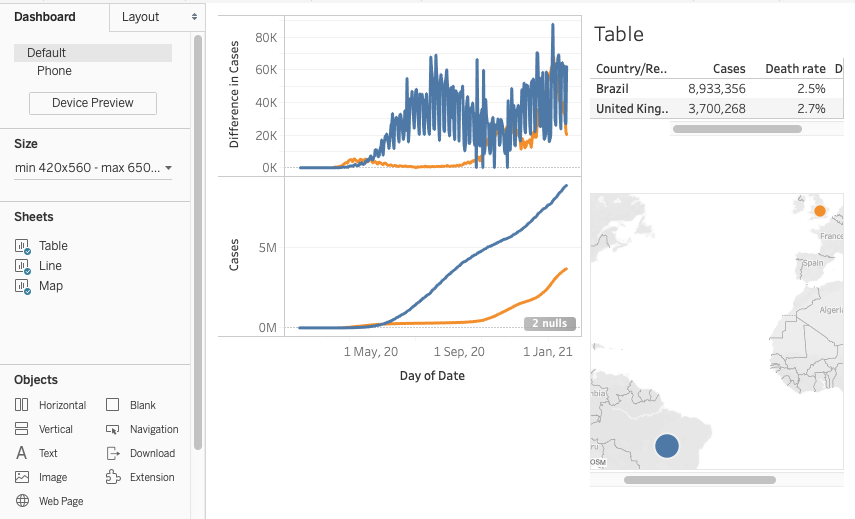
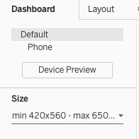
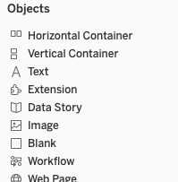
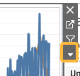
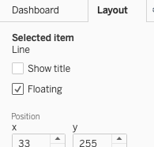
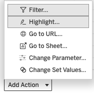

# Assembling the dashboard
In Tableau a _Dashboard_ is a display that brings together the content from multiple sheets. A dashboard may also have additional text and images, and it can be configured with _Actions_ to make it more interactive.

Assembling the pieces of a dashboard can take time, especially as you learn to adjust the size, position, formatting, and relationships among the components of your dashboard. 

### *1*{: .circle .circle-yellow} Add a dashboard
1. From the top menu select _Dashboard -> New Dashboard_
2. Your sheets are listed on the left; drag them into position in the central dashboard pane
{: .step}

## Dashboard tips
The content, formatting, and behaviour choices for a dashboard will depend on its audience and purpose. There are many more features than we can cover in this workshop - here are some tips to get you started.

### Choosing the size
In the top left of the screen are options for setting the dashboard size and checking how it will display on various interfaces (e.g. phones, tablets, laptops).

### Adding text and images 
In the bottom left are other non-sheet _Objects_ you can add by dragging them to the desired position on the dashboard. Use a _Text_ object to create a dashboard title or add a note about the data source. A _Blank_ object is sometimes useful for spacing content.

### Add legends, filters, and adjust object settings 
When an object on the dashboard is selected a set of icons will appear in the top-right corner. Click the down arrow for a menu with additional formatting options. If you want to include a filter for the user to control, choose it from the _Filter_ submenu. 

### Layout options
A tab at the top left of the screen leads to other layout options. _Floating_ changes how the selected object can be positioned on the dashboard, allowing it to overlap other objects. 

### Adding _Actions_
Dashboard _Actions_ can make your dashboard more interactive. A _Highlight_ action, for example, can highlight corresponding content in *all* sheets when a viewer hovers over one of them. 

To add an action select _Dashboard -> Actions_ from the top menu, then use the pop-up window to add the desired action.

## Saving your work
Use the _File -> Save_ menu to save your work as a Tableau _workbook_. The saving options depend on which Tableau product you are using.

- **Tableau Desktop Public Edition** users must save their work to an online Tableau Public account. Accounts are free, but saving online is not suitable if you are working with private or sensitive data.
- **Tableau Desktop** users may save their work locally or to an online Tableau Public account. 
