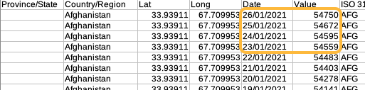
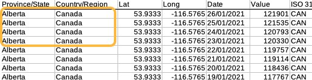
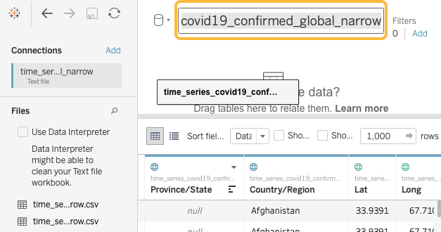

# Connecting to data

The sample data ([download ZIP file](data/time_series_covid19.zip)) consists of two files from the [Novel Coronavirus (COVID-19) Cases Data](https://data.humdata.org/dataset/novel-coronavirus-2019-ncov-cases) compiled by the Johns Hopkins University Center for Systems Science and Engineering (JHU CCSE). The second header line was removed from each file to simplify import into Tableau.

- **time_series_covid19_confirmed_global_narrow.csv** - confirmed cases by day and country
- **time_series_covid19_deaths_global_narrow.csv** - deaths by day and country

## Data structure
The _cases_ and _deaths_ files are structured the same way. Each day there is one row for each geographic area; the _Value_ column contains the cumulative total count up to that date.

For some countries data is available at the _Province/State_ level. In these cases there are multiple rows per day, one for each province/state.

"Narrow" data is preferable to "wide" data in visualization software. The COVID-19 data is available in wide format (one column per day), but it's best to keep all values in the same column as in the narrow format shown above.
{: .note}
 
## Connecting to multiple data files
Our sample dataset is in two files. Tableau has several options for bringing data from multiple sources into the same _workbook_. 

- **Blend.** This is the approach we will use with the COVID-19 data. Each file is added as a separate data source.
- **Union.** Use this when you have several files with the same structure and variables, each with a different set of observations (e.g. a separate file for each month). A Tableau union "stacks" the files in a single data source.
- **Join.** This is like a database join, where you specify the type of join (e.g. left, right, inner) and the field(s) used for linking the data sources.

### *1*{: .circle .circle-yellow} Add the _confirmed_ file
1. Open Tableau and select _Text file_ in the _Connect to Data_ menu
2. Select `time_series_covid19_confirmed_global_narrow.csv`
3. Once loaded, the file name will appear near the top of the page; click it and rename to `cases`

### *2*{: .circle .circle-yellow} Add the _deaths_ file as a new data source
1. From the _Data_ menu choose _New Data Source_

2. Select `time_series_covid1_deaths_global_narrow.csv` and rename it `deaths`

Once both files are added click the _Sheet 1_ tab near the bottom of the screen. The newly added data sources will be listed in the top left corner of the sheet.

## Checking your work
As you work with any visualization or analysis software it's important to check your work to make sure calculations behave as you intend. This table shows two countries' case and death totals as of January 26, 2021. As you create new tables and graphs, check your work against these totals. 

