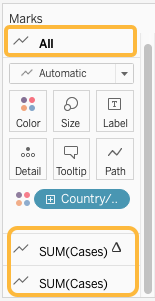

# Formatting
  
## Exploring the _Marks_ card
Dragging _Country/Region_ to the _Color_ section of the _Marks_ card added new information to the graph, encoded as colour. The _Marks_ card also allows you to adjust other formatting.
 
On a sheet with more than one measure the _Marks_ card settings can apply to the entire sheet or just to one measure. Notice how the _Marks_ card in our line graph has several sections: `All`, `SUM(Cases)` (with a triangle indicating a calculated field), and `SUM(Cases)`. Clicking each of these reveals a separate _Marks_ card with independent settings.

## Exercise 4: experiment with with formatting options
Take a few minutes to explore and play with the options in the _Marks_ card. There's no "right" answer here, just an opportunity to try things out and ask questions. If you're not sure where to start here are some things to try:

- Change the thickness (size) of the lines to make them easier to read. 
- Change the "opacity" of the lines so it's easier to see areas where the lines overlap.
- Adjust the graphs so one has a single line showing the total for all selected countries, while the other has a coloured line for each country
- Reformat a tooltip to make it easier to read and interpret
- Add _Deaths_ to the tooltips, with a table calculation where appropriate

## Optional: add a map
Formatting options relevant to one graph type may not be suitable for another. Create a map to explore other ways of representing the data. 

### *1*{: .circle .circle-yellow} Create a map based on _Cases_
1. Add a new _sheet_ and label it _Map_
2. Double-click _Country/Region_
3. Drag _Cases_ onto the _Size_ section of the _Marks_ card
4. Drag _Country/Region_ onto the _Color_ section of the _Marks_ card
{: .step}

Once again, play with the _Marks_ card settings to see what happens. (Don't be afraid to experiment, you can always _Undo_.)
