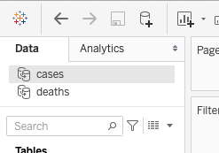
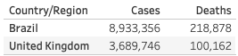
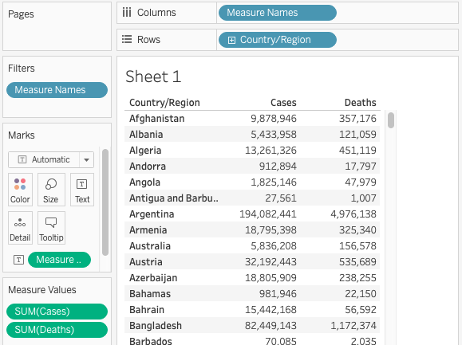
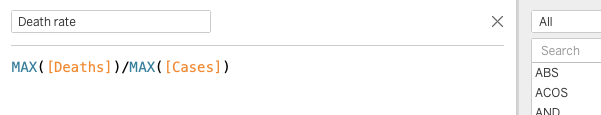

# Calculations: part 1
## Orientation and setup
The measures and dimensions from both tables will appear along the left of the Tableau _sheet_. Under the heading for each table, dimensions are listed near the top followed by measures below the horizontal line.

## Checking your work
As you work with any visualization or analysis software it's important to check your work to make sure calculations behave as you intend. This table shows two countries' case and death totals as of January 26, 2021. As you create new tables and graphs, check your work against these totals. 

### *1*{: .circle .circle-yellow} Rename _Value_ to avoid confusion
The measure we will use in the sample dashboard is named _Value_ in both tables. It contains the cumulative number of deaths or cases, depending on the table.

In the cases table, right-click _Value_ rename it to _Cases_. Move to the deaths table and rename _Value_ to _Deaths_.
{: .step}

## Create summary table
To experiment with calculations we'll create a summary table listing total cases, deaths, and the death _rate_ for each country. 

### *2*{: .circle .circle-yellow} Add dimensions and measures
1. Drag _Country/Region_ to the _Rows_ shelf
2. Double-click the _Cases_ measure and the _Deaths_ measure to add them to the table
{: .step}

## Exercise 1: fixing the totals
Compare the totals in your table to the verification table. _(Hint: add a filter for Country/Region to make this easier)_

Do they match? If not, try to find a solution.

Click for hints

 
The data for each day is the *total* number of cases and deaths, not the number of new cases recorded on that particular date. Make sure the table shows only the most recent total.

## Using _Calculated Fields_ to create a new measure
You can perform calculations and manipulate data in Tableau, then save the output as a new dimension or measure to use in charts or in other calculations. These _Calculated Fields_ can take advantage of many functions, analogous to formulas in Excel. We will introduce the concept with a simple mathematical function; for a full list of available functions see [this Tableau help article](https://help.tableau.com/current/pro/desktop/en-us/functions.htm). 

### *3*{: .circle .circle-yellow} Create a measure for death _rate_
1. In the list of measures and dimensions, right-click _Cases_ and select _Create -> Calculated Field_
2. Name the calculation _Death rate_
3. Enter this formula in the calculation window: `SUM([Deaths])/SUM([Cases])`, then click _OK_
{: .step}

Locate the new _Death rate_ measure in the list, then double-click it add it to the table. 

## Exercise 2: number formats
The _Death rate_ is a percentage but is not formatted as one by default. There are several ways to control how numbers appear in Tableau. Explore right-click menus for a way to display the _Death rate_ as a percentage.

