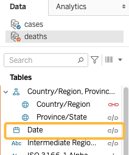
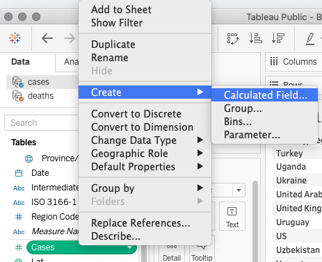

# Calculations: part 1
## Finding your way around
At this stage our sample workbook has two data sources. You can switch between them by clicking their titles in the top left of any Tableau _sheet_. 

Each of the variables (columns) in the datasets is listed on the left: _dimensions_ at the top and _measures_ on the bottom, below the horizontal line.

The measure we will use in the sample dashboard is named _Value_. It contains the cumulative number of deaths or cases, depending on the data source.

### *1*{: .circle .circle-yellow} Rename _Value_ to avoid confusion
In the cases data source, right-click _Value_ rename it to _Cases_. Switch to the deaths data source and rename _Value_ to _Deaths_.

## Create summary table
To experiment with calculations we'll create a summary table listing total cases, deaths, and the death _rate_ for each country. 

### *2*{: .circle .circle-yellow} Add dimensions and measures
1. Drag _Country/Region_ to the _Rows_ shelf
2. Double click the  _Cases_ measure to add it to the table
3. Switch data sources and double-click the _Deaths_ measure

### *3*{: .circle .circle-yellow} Check dataset relationships
When we added measures from each dataset Tableau established a relationship between the datasets.

- The orange check-mark indicates the secondary data source
- In the secondary data source, chain icons appear next to dimensions that are common to both data sources
	- Red chain: active link
	- Grey chain: inactive link
- Click a chain to toggle active/inactive

**Important:** make sure the chain is active for **both** _Country/Region_ and _Date_ fields.
 
## Exercise 1: fixing the totals
Compare the totals in your table to the verification table. _(Hint: add a Country filter to make this easier)_

Do they match? If not, try to find a solution.

## Calculate death rate
You can perform calculations and manipulate data in Tableau using _Calculated Fields_.  

### *4*{: .circle .circle-yellow} Create _Calculated Field_

1. Right-click the _Cases_ measure and select _Create -> Calculated Field_
2. Name the calculation _Death rate_
3. Enter this in the calculation window: `SUM([deaths].[Deaths])/SUM([Cases])`

4. Click _OK_, then locate the new _Death rate_ measure and add it to the table. 

## Exercise 2: number formats
The _Death rate_ is a percentage but is not formatted as one by default. Explore right-click menus for a way to change the number format.

