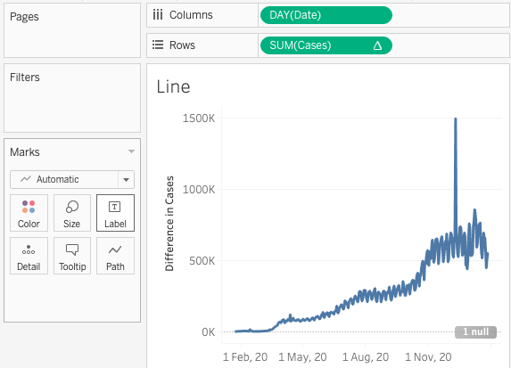
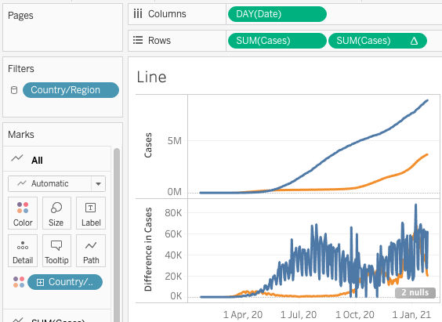
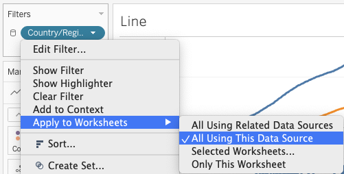

# Calculations: part 2
In this section we'll create a line graph showing cases over time, introducing several Tableau features along the way:
- Table calculations
- Using the _Marks_ card with dimensions/measures 

### *1*{: .circle .circle-yellow} Create a line graph of _Cases_ 
The foundation for this section is a line graph with each day represented on the horizontal axis. Start by adding a new _sheet_ and renaming it _Line_.
1. Double click the _Cases_ measure to add it to the chart
2. Double-click _Date_ to add it to _Columns_ shelf
3. Right-click _Date_ on the _Columns_ shelf and select the second _Day_ format

{: .step}

The result is a simple line graph showing total cases for each day.

## Table calculations 
A _table calculation_ is similar to a calculated field but it does not create a new measure/dimension and only applies to the current sheet. 

### *2*{: .circle .circle-yellow} Add a _table calculation_ to show new cases per day
1. Right-click the `SUM(Cases)` measure on the columns shelf and select _Add Table Calculation_
2. Review the settings in the pop-up window. To show new cases per day:
  - Calculation Type: _Difference From_
  - Compute Using: _Table (across)_
  - Relative to: _Previous_
{: .step}

The _Quick Table Calculation_ menu option is a shortcut to generate a table calculation with default settings. If you need to edit a calculation's settings, use the right-click menu option to _Edit Table Calculation_.
{: .note}
 
## Exercise 3: a graph with two measures
The new line graph shows the number of new cases each day. What if you want to display both line graphs at the same time: one for the total number of cases, and the second for the new cases?

Click for hints

 
The same measure can be added to a display more than once, with different calculations and formatting options applied to it each time.

## Adding _Country/Region_ information
So far our graphs show information for all countries combined. With the _Marks_ cards we can add new elements to the graph and format them.

### *3*{: .circle .circle-yellow} Represent each _Country/Region_ as a coloured line 
1. Drag the _Country/Region_ dimension onto the _Colors_ section of the _Marks_ card.
2. Tableau may warn you that this action will add more than the recommended number of items to this shelf; click the _Filter and then add_ option
3. Select the countries you wish to display, then click _OK_
{: .step}

 This example shows Brazil and the United Kingdom

## Filter settings: continuity across sheets
We now have a table with summary information on one sheet, and a second sheet with a line graph showing change over time. A filter controls which countries appear in the line graph. 

In a dashboard we may want a filter to control multiple sheets at the same time. The range of a filter can be changed by right-clicking it on the _Filters_ card and using the _Apply to Worksheets_ sub-menu.

