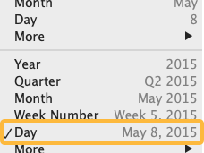
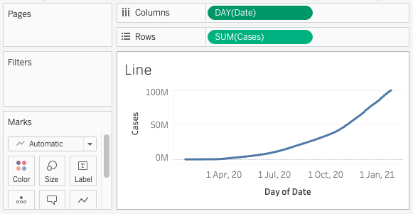

# Calculations: part 2
In this section we'll create a line graph showing cases over time, introducing several Tableau features along the way:
- Table calculations
- Using the _Marks_ cards with dimensions/measures 

### *1*{: .circle .circle-yellow} Create line graph 
The foundation for this section is a line graph with each day represented on the horizontal axis. Start by adding a new _sheet_ and renaming it _Line_.
1. In the _cases_ data source, double click the _Cases_ measure
2. Double-click _Date_ to add it to _Columns_ shelf
3. Right-click _Date_ on the _Columns_ shelf and select the _Day_ format

The simple line graph:

## Table calculations 
A _table calculation_ is similar to a calculated field but it does not create a new measure/dimension. It applies to a single sheet and is affected by the layout of your data. To create a table calculation, add a measure to your sheet, right-click it, then select _Add table calculation_.

A _quick calculation_ is a shortcut to generate a table calculation with default settings. If the _quick calculation_ needs to be adjusted, use the right-click menu option to _edit table calculation_.
{: .note}

### *1*{: .circle .circle-yellow} Add a _table calculation_ to show new cases per day

 
## Exercise 2: calculate new cases 

## A graph with two measures

